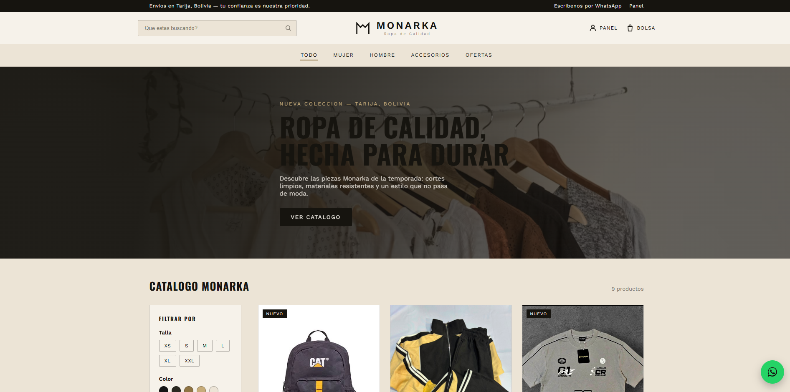
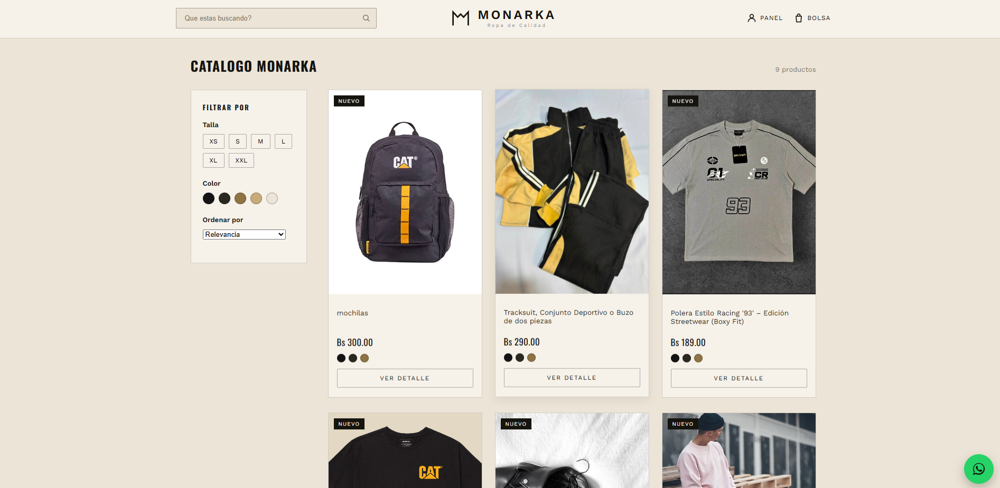
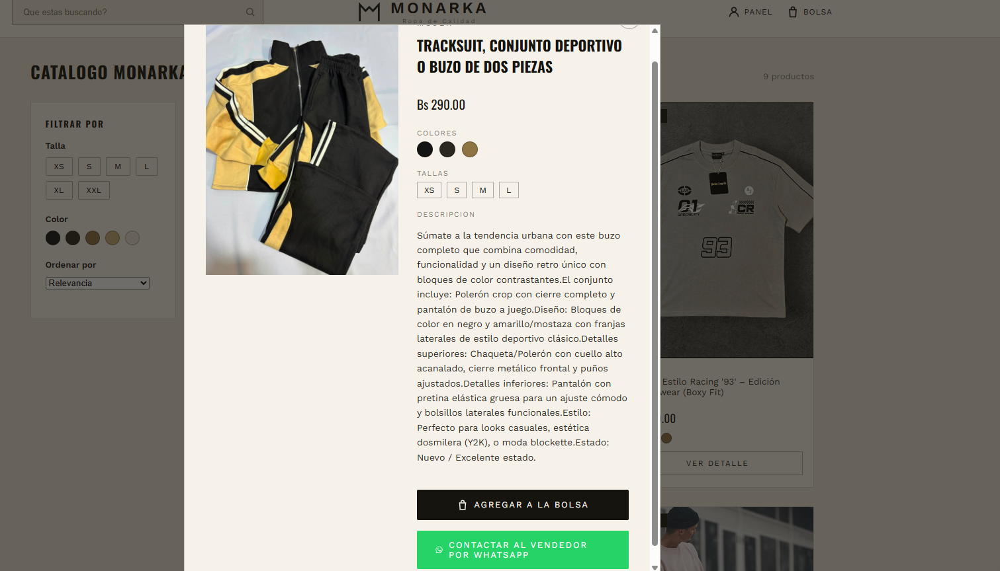
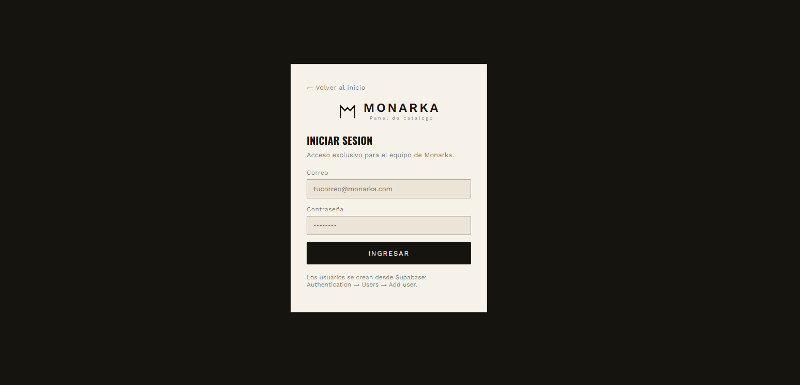
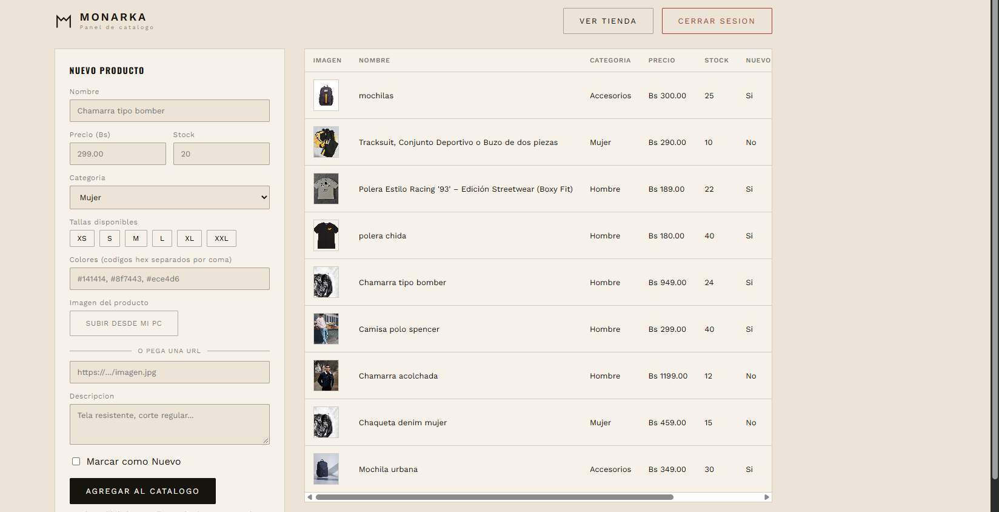

# Monarka — Tienda de ropa

Tienda online para **Monarka** (Tarija, Bolivia): catálogo público con filtros, bolsa de compras y
pedido por WhatsApp, más un panel de administración protegido para gestionar los productos.

**Stack:** React 18 · Vite 7 · React Router 7 · Supabase (base de datos, Auth y Storage) · Vercel

Demo: https://monarka-store-ecru.vercel.app/

## Capturas

### Tienda







### Panel de administración





## Qué incluye

- **Catálogo** con búsqueda, categorías (Mujer, Hombre, Accesorios, Ofertas) y filtros por talla,
  color y orden.
- **Detalle de producto** con fotos, colores, tallas y descripción.
- **Bolsa de compras**: el cliente elige talla y color, ajusta cantidades y ve el total. Se guarda en
  el navegador, así que no se pierde al recargar.
- **Pedido por WhatsApp**: la bolsa genera un mensaje con el detalle del pedido listo para enviar.
  No hay pasarela de pago; el pago y el envío se coordinan por chat.
- **Panel `/admin`** con inicio de sesión: crear, editar y eliminar productos, y subir fotos.
- **Base de datos segura**: lectura pública y escritura solo con sesión iniciada (políticas RLS de
  Supabase).

## Inicio rápido

Requisitos: **Node.js 20.19 o superior**.

```bash
npm install
cp .env.example .env     # y completa tus credenciales de Supabase
npm run dev              # http://localhost:5173
```

Antes de que el catálogo funcione hay que preparar Supabase (tablas, imágenes y usuario admin).
Guía paso a paso: **[docs/SUPABASE.md](docs/SUPABASE.md)**.

## Rutas

| Ruta     | Qué es                                                          | Acceso          |
| -------- | --------------------------------------------------------------- | --------------- |
| `/`      | Tienda: hero, catálogo con filtros, bolsa, footer, FAQ          | Público         |
| `/login` | Inicio de sesión del equipo                                     | Público         |
| `/admin` | Panel: crear, editar y eliminar productos, subir fotos          | Requiere sesión |

## Cómo funciona la bolsa

1. En **Ver detalle** el cliente elige color y talla (si el producto los tiene) y pulsa
   **Agregar a la bolsa**.
2. Se abre el panel lateral con los productos, cantidades (máximo 10 por línea) y el total.
   El mismo producto en otra talla o color cuenta como otra línea.
3. **Finalizar pedido por WhatsApp** abre un mensaje con el pedido ya escrito al número configurado
   en `src/config/site.js`.

Notas:

- El precio queda guardado en la bolsa en el momento en que se agrega. El vendedor confirma
  disponibilidad y precio final por WhatsApp.
- El **stock** no se valida al agregar a la bolsa.
- La bolsa no usa la base de datos: vive en `localStorage` (`monarka:cart:v1`).

## Scripts

| Comando           | Qué hace                        |
| ----------------- | ------------------------------- |
| `npm run dev`     | Servidor de desarrollo          |
| `npm run build`   | Build de producción en `dist/`  |
| `npm run preview` | Sirve el build localmente       |
| `npm run lint`    | Revisa el código con ESLint     |
| `npm run format`  | Formatea el código con Prettier |

## Estructura del proyecto

```
monarka-store/
├── docs/                  Documentación (arquitectura, Supabase) y capturas
├── public/                Archivos estáticos (logo/favicon)
├── supabase/              Scripts SQL: setup/ (primera vez) y maintenance/ (puntuales)
└── src/
    ├── main.jsx           Punto de entrada
    ├── app/               Composición de la app: providers y rutas
    ├── pages/             Una carpeta por ruta (home, login, admin); solo componen
    ├── features/          Lógica y UI por dominio: auth, products, cart, admin, help
    ├── components/        Componentes compartidos: ui/ (genéricos) y layout/ (Header, Footer…)
    ├── config/            Datos de marca y contacto (WhatsApp, redes)
    ├── lib/               Clientes de servicios externos (Supabase)
    ├── utils/             Funciones puras auxiliares
    └── styles/            CSS global dividido por sección
```

Para entender **dónde va cada cosa** y las reglas del proyecto, lee
**[docs/ARCHITECTURE.md](docs/ARCHITECTURE.md)**.

## Cambios frecuentes

| Quiero cambiar…                        | Archivo                                |
| -------------------------------------- | -------------------------------------- |
| Número de WhatsApp o redes sociales    | `src/config/site.js`                   |
| Preguntas frecuentes                   | `src/features/help/faqs.js`            |
| Categorías, tallas u opciones de orden | `src/features/products/constants.js`   |
| Máximo de unidades por línea en bolsa  | `src/features/cart/cartModel.js`       |
| Texto del pedido de WhatsApp           | `src/features/cart/cartModel.js`       |
| Colores y tipografía de la marca       | `src/styles/tokens.css` y `index.html` |

## Despliegue

El proyecto está listo para **Vercel**: `vercel.json` redirige todas las rutas a `index.html`
(necesario para que `/admin` y `/login` funcionen al recargar). Configura en Vercel las variables
`VITE_SUPABASE_URL` y `VITE_SUPABASE_ANON_KEY`.

## Documentación

- [docs/ARCHITECTURE.md](docs/ARCHITECTURE.md): organización del código y convenciones.
- [docs/SUPABASE.md](docs/SUPABASE.md): preparar la base de datos, el almacenamiento y el usuario admin.
